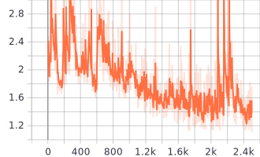

# Object Detection in an Urban Environment
## Data

For this project, we will be using data from the [Waymo Open dataset](https://waymo.com/open/).

[OPTIONAL] - The files can be downloaded directly from the website as tar files or from the [Google Cloud Bucket](https://console.cloud.google.com/storage/browser/waymo_open_dataset_v_1_2_0_individual_files/) as individual tf records. We have already provided the data required to finish this project in the workspace, so you don't need to download it separately.


## Structure
### Data

The data you will use for training, validation and testing is organized as follow:
```
/home/workspace/data
    - train: contains the training data
    - val: contains the validation data
    - test: contains 3 files to test your model and create inference videos
```
The `training_and_validation` folder contains files that have been downsampled: we have selected one every 10 frames from 10 fps videos. The `test` folder contains frames from the 10 fps video without downsampling.


### Experiments
The experiments folder will be organized as follow:
```
experiments/
    - pretrained_model/
    - exporter_main_v2.py - to create an inference model
    - model_main_tf2.py - to launch training
    - reference/ - reference training with the unchanged config file
    - experiment0/ - create a new folder for each experiment you run
    - experiment1/ - create a new folder for each experiment you run
    - experiment2/ - create a new folder for each experiment you run
    - label_map.pbtxt
    ...
```

## Prerequisites
### Local Setup

For local setup if you have your own Nvidia GPU, you can use the provided Dockerfile and requirements in the [build directory](./build).

Follow [the README therein](./build/README.md) to create a docker container and install all prerequisites.


### Download and process the data

**Note:** ”If you are using the classroom workspace, we have already completed the steps in the section for you. You can find the downloaded and processed files within the `/home/workspace/data/preprocessed_data/` directory. Check this out then proceed to the **Exploratory Data Analysis** part.

The first goal of this project is to download the data from the Waymo's Google Cloud bucket to your local machine. For this project, we only need a subset of the data provided (for example, we do not need to use the Lidar data). Therefore, we are going to download and trim immediately each file. In `download_process.py`, you can view the `create_tf_example` function, which will perform this processing. This function takes the components of a Waymo Tf record and saves them in the Tf Object Detection api format. An example of such function is described [here](https://tensorflow-object-detection-api-tutorial.readthedocs.io/en/latest/training.html#create-tensorflow-records). We are already providing the `label_map.pbtxt` file.

You can run the script using the following command:
```
python download_process.py --data_dir {processed_file_location} --size {number of files you want to download}
```

You are downloading 100 files (unless you changed the `size` parameter) so be patient! Once the script is done, you can look inside your `data_dir` folder to see if the files have been downloaded and processed correctly.


### Classroom Workspace

In the classroom workspace, every library and package should already be installed in your environment. You will NOT need to make use of `gcloud` to download the images.


## Instructions
### Exploratory Data Analysis

You should use the data already present in `/home/workspace/data` directory to explore the dataset! This is the most important task of any machine learning project. To do so, open the `Exploratory Data Analysis` notebook. In this notebook, your first task will be to implement a `display_instances` function to display images and annotations using `matplotlib`. This should be very similar to the function you created during the course. Once you are done, feel free to spend more time exploring the data and report your findings. Report anything relevant about the dataset in the writeup.

Keep in mind that you should refer to this analysis to create the different splits (training, testing and validation).


### Edit the config file

Now you are ready for training. As we explain during the course, the Tf Object Detection API relies on **config files**. The config that we will use for this project is `pipeline.config`, which is the config for a SSD Resnet 50 640x640 model. You can learn more about the Single Shot Detector [here](https://arxiv.org/pdf/1512.02325.pdf).

First, let's download the [pretrained model](http://download.tensorflow.org/models/object_detection/tf2/20200711/ssd_resnet50_v1_fpn_640x640_coco17_tpu-8.tar.gz) and move it to `/home/workspace/experiments/pretrained_model/`.

We need to edit the config files to change the location of the training and validation files, as well as the location of the label_map file, pretrained weights. We also need to adjust the batch size. To do so, run the following:
```
python edit_config.py --train_dir /home/workspace/data/train/ --eval_dir /home/workspace/data/val/ --batch_size 2 --checkpoint /home/workspace/experiments/pretrained_model/ssd_resnet50_v1_fpn_640x640_coco17_tpu-8/checkpoint/ckpt-0 --label_map /home/workspace/experiments/label_map.pbtxt
```
A new config file has been created, `pipeline_new.config`.


### Training

You will now launch your very first experiment with the Tensorflow object detection API. Move the `pipeline_new.config` to the `/home/workspace/experiments/reference` folder. Now launch the training process:
* a training process:
```
python experiments/model_main_tf2.py --model_dir=experiments/reference/ --pipeline_config_path=experiments/reference/pipeline_new.config
```
Once the training is finished, launch the evaluation process:
* an evaluation process:
```
python experiments/model_main_tf2.py --model_dir=experiments/reference/ --pipeline_config_path=experiments/reference/pipeline_new.config --checkpoint_dir=experiments/reference/
```

**Note**: Both processes will display some Tensorflow warnings, which can be ignored. You may have to kill the evaluation script manually using
`CTRL+C`.

To monitor the training, you can launch a tensorboard instance by running `python -m tensorboard.main --logdir experiments/reference/`. You will report your findings in the writeup.


### Improve the performances

Most likely, this initial experiment did not yield optimal results. However, you can make multiple changes to the config file to improve this model. One obvious change consists in improving the data augmentation strategy. The [`preprocessor.proto`](https://github.com/tensorflow/models/blob/master/research/object_detection/protos/preprocessor.proto) file contains the different data augmentation method available in the Tf Object Detection API. To help you visualize these augmentations, we are providing a notebook: `Explore augmentations.ipynb`. Using this notebook, try different data augmentation combinations and select the one you think is optimal for our dataset. Justify your choices in the writeup.

Keep in mind that the following are also available:
* experiment with the optimizer: type of optimizer, learning rate, scheduler etc
* experiment with the architecture. The Tf Object Detection API [model zoo](https://github.com/tensorflow/models/blob/master/research/object_detection/g3doc/tf2_detection_zoo.md) offers many architectures. Keep in mind that the `pipeline.config` file is unique for each architecture and you will have to edit it.

**Important:** If you are working on the workspace, your storage is limited. You may to delete the checkpoints files after each experiment. You should however keep the `tf.events` files located in the `train` and `eval` folder of your experiments. You can also keep the `saved_model` folder to create your videos.


### Creating an animation
#### Export the trained model

Modify the arguments of the following function to adjust it to your models:

```
python experiments/exporter_main_v2.py --input_type image_tensor --pipeline_config_path experiments/reference/pipeline_new.config --trained_checkpoint_dir experiments/reference/ --output_directory experiments/reference/exported/
```

This should create a new folder `experiments/reference/exported/saved_model`. You can read more about the Tensorflow SavedModel format [here](https://www.tensorflow.org/guide/saved_model).

Finally, you can create a video of your model's inferences for any tf record file. To do so, run the following command (modify it to your files):
```
python inference_video.py --labelmap_path label_map.pbtxt --model_path experiments/reference/exported/saved_model --tf_record_path /data/waymo/testing/segment-12200383401366682847_2552_140_2572_140_with_camera_labels.tfrecord --config_path experiments/reference/pipeline_new.config --output_path animation.gif
```

## Submission Template
### Project overview

This repository contains the results of the project "Object Detection in Urban Environment" of Udacity's "Self-driving Car Engineer" Nanodegree.  The project is about detecting objects, such as cars, pedestrians and cyclists in images of the Waymo Open Dataset with the Tensorflow Object Detection API (SSD Resnet-50 640x640).  It is structured as follows:
* Set up to run the code for this repository
* Exploratory data analysis to better understand the data
* Creation of training, testing and validation data splits
* Training of model with Tensorflow object detection API
* Post-processing to create an animation


### Set up

To run this model, the workspace provided by Udacity was used.  This workspace can be set up by following the instructions in the `build` folder.


### Dataset

In this section, the dataset is analyzed, and the creation of training, testing and validation splits is explained.


#### Dataset analysis

The dataset is analyzed in 2 steps: first, qualitatively based on visual inspection of images with bounding boxes, then quantitatively by considering the distribution of class occurrences in images.

Results in this section were obtained by the Jupyter notebook `Exploratory Data Analysis.ipynb` based on the data in `data/train`.  Stricly speaking, this analysis should be performed on all available data and the splits (training, validation, testing) should then be created by random sampling.  Due to the instability of the work environement provided by Udacity (crashes of Jupyter in Firefox and Chromium) and the preselection of the data in this environement (available files in `training` / `validation` / `testing` folders), these last steps had not to be performed.


##### Visual inspection

The dataset includes images in various conditions as illustrated hereafter by 10 instances:
* at different times of the day: day, dawn, night
* in different weather conditions: sunny, foggy, rainy
* in different environments: city, suburban, highway

Represented ground truth annotations frequently include cars (red) and pedestrians (blue), while cyclists (green) are more rare.  Further, some images seem to not have been annotated (the car in the picture at night).


##### Distribution of classes

The averge number of objects per image based on a random sample of 10,000 images is illustrated in the following figure.  It confirms our previous qualitative assessment by stating that cars and pedestrians are much more frequent than cyclists.  More precisely, about 17 vehicles, 5 pedestrians and 0.1 cyclists appear on average in an image, which is realistic in a North American urban context.


In the following subsections, the distributions of vehicles, pedestrians and cyclists are described based on a random sampling of 10,000 images.


###### Distribution of vehicles

As illustrated below, images contain numerous vehicles with an irregular distribution decreasing to almost zero at about 40 vehicles.


###### Distribution of pedestrians

About 50% of all images do not contain any pedestrian as shown by the initial bar in the following histogram.  If pedestrians are included, there are about 1 to 10.  At most, around 40 pedestrians are included in an image.


###### Distribution of cyclists

As mentioned earlier, cyclists are very rare.  About 90% of the considered images do not contain any cyclist.  If cyclists are included in an image, there is mostly only one.  At most, around 4 simultaneous cyclists were found in the considered set of images.


#### Cross validation

The data split was already provided in the folders `data/train` and `data/val` with respectively 86 and 10 files, i.e., a 86/96 = 90% training data / 10% validation data split.  According to the general guidelines in this course (80-90% / 10-20%), this a reasonable split.  It is assumed that the files have been shuffled randomly to have the same underlying distributions in both data sets.  This assumption could be tested by reiterating the previous analysis for the files in `data/val`.  This is not done here due to the instability of the work environement and the preselection of the data, as explained earlier.


### Training

In this section, the SSD Resnet-50 640x640 model is trained based on the previous data: first, by using the provided reference configuration, and later, by using improved configurations for training.

Therefore, the pretrained model is first downloaded and decompressed by the following commands:

    cd /home/workspace/experiments/pretrained_model/

    wget http://download.tensorflow.org/models/object_detection/tf2/20200711/ssd_resnet50_v1_fpn_640x640_coco17_tpu-8.tar.gz

    tar -xvzf sd_resnet50_v1_fpn_640x640_coco17_tpu-8.tar.gz

    rm -rf sd_resnet50_v1_fpn_640x640_coco17_tpu-8.tar.gz


To paramerize a training run a configuration file is created as follows:

    cd /home/workspace/

    python edit_config.py --train_dir /home/workspace/data/train/ --eval_dir /home/workspace/data/val --batch_size 2 --checkpoint /home/workspace/experiments/pretrained_model/ssd_resnet50_v1_fpn_640x640_coco17_tpu-8/checkpoint/ckpt-0 --label_map /home/workspace/experiments/label_map.pbtxt


The created `pipeline_new.config` file is then moved to an "experiment" folder, e.g., `/home/workspace/experiments/reference`, which will contain the resulting training results after starting the training by the following command:

    python experiments/model_main_tf2.py --model_dir=experiments/reference/ --pipeline_config_path=experiments/reference/pipeline_new.config


Results can later be analyzed by the Tensorboard:

    python -m tensorboard.main --logdir experiments/reference/


An finally the cross-validation run is executed as follows:

    python experiments/model_main_tf2.py --model_dir=experiments/reference/ --pipeline_config_path=experiments/reference/pipeline_new.config --checkpoint_dir=experiments/reference/


#### Reference experiment

As illustrated by the total loss (as a function of iterations) below, no convergence to a relatively small loss can be observed even after 2500 iterations.  In consequence, precision and recall are close to 0.


#### Improve on the reference

Since the model did not converge to a relatively small loss, different options are available to further reduce it, i.a.:
- **Increase the number of iterations**: considering the low convergence speed in the previous picture, this option cannot be recommended. In addition, the instability of the work environment provided by Udacity, its low speed and its automatic shutdown after 5 min, when the user is not clicking on a pop-up windows, make this option hardly feasible;
- **Decrease the learning rate to prevent overshoots**: this option is tested hereafter;
- **Increase the batch size to obtain a better gradient estimation**: this option is tested hereafter;
- **Change the optimization algorithm**, e.g. to the Adam optimizer, which is known to work particularly well with a wide range of neural networks: this option is tested hereafter.

In addition to the previous option, data augmentation is added later on.


##### Reduction of the learning rate

The learning rate (`learning_rate_base`) is reduced from 0.04 to 0.02 (experiment01).  As indicated by the following figure, the total loss is significantly smaller than in the reference experiment.  This is clearly an improvement.


Nevertheless, the loss still remains relatively significant, which becomes apparent, when validating the model.  In fact, no car, pedestrian or bicycle was detected in the following illustration, which compares model results to ground truth.


##### Increase of the batch size

The batch size (`batch_size`) is increased from 2 to 4 (experiment02). Overall, the loss is significantly smaller than previously.  The decreasing trend indicates that increasing the number of iterations could further decrease the loss.  As explained earlier, this is hardely feasible with the work environment provided by Udacity, which is why this option is not further analyzed.  As an alternative, the optimizer Adam is applied in the following section.


##### Change the optimization algorithm

The optimizer Adam ([link](https://www.tensorflow.org/api_docs/python/tf/keras/optimizers/Adam)) is applied with exponential decay ([link](https://www.tensorflow.org/api_docs/python/tf/keras/optimizers/schedules/ExponentialDecay)) of the learning rate and the default learning rate of 0.001; all other hyperparameters are unchanged with respect to the reference configuration (experiment03).  The following figure shows that the resulting total loss decreases more significantly than in the previous experiments.  It increases, however, towards the end, which suggests, that either the learning rate is too high or the approximation of the gradient too crude.




For this reason, the batch size is again increased from 2 to 4, still with the Adam optimizer (experiment04).  The resulting total loss becomes for the first time smaller than 1, as shown below.


The model now becomes usefull as the location of cars starts to be predicted.  This is illustrated by the following figure, which compares again the model results to the corresponding ground truth.


Since the loss is still relatively high (around 1), the learning rate is reduced to 0.00005 (from 0.001, after having tested larger learning rates) and the decay steps to 700 (from 2500), in addition to keeping the batch size at 4 (instead of 2).  This hyperparameter tuning in experiment 5 finally reduces the total loss consistently below 1 (smoothing in representation set to 0.95).


In comparison to experiment 4, one additional car, which is further away and expected to be more difficult to detect, was detected in the following validation example:


While the smoothed total training loss (smoothing = 0.95) is equal to 0.59, the total validation loss is equal to 0.84.  If the validation loss is higher than the training loss, as in this case, it means that the model is overfitting to the training data.  To avoid overfitting, data augmentation instead of collecting more training data can be applied.


##### Data augmentation

To increase the training sample size, three different augmentation methods, which create realistic extrapolations of the initial training sample, are used in experiment 6:
- **Random RGB to gray** (probability of 0.2), simulating a day-to-night transformation
- **Random adjustment of brightness** (max_delta of 0.2), simulating different lighting conditions
- **Random adjustment of contrast** (min_delta of 0.8, max_delta of 1.25), simulating different lighting conditions

These augmentation are illustrated by the following images, in which the contrast adjustment is the least visible:


The resulting total loss is shown in the following figure as a function of the iterations.  The comparison of this loss with the loss in experiment 5, i.e., without data augmentation indicates that the result have a become slightly worse in the sense that the total training loss has increased from 0.59 to 0.61 (smoothing of 0.95).


The corresponding validation loss has also slightly increased from 0.84 to 0.86.  This very small variation does not allow any conclusion besides that fact, that data augmentation within the previous bounds does not have a significant influence on the detective ability of the model.  This parametric study could be continued by introducing stronger augmentations, but considering the very restrictive nature of Udacity's work environment (explained above), it is ended here.


### Animation

Finally animations are created to illustrate the ability of the model to detect the respective objects in the model.  These animation are created by the following commands, in which the test data sets are used:

    python experiments/exporter_main_v2.py --input_type image_tensor --pipeline_config_path experiments/experiment06/pipeline_new.config --trained_checkpoint_dir experiments/experiment06/ --output_directory experiments/experiment06/exported/

    python inference_video.py --labelmap_path label_map.pbtxt --model_path experiments/experiment06/exported/saved_model --tf_record_path data/test/segment-12200383401366682847_2552_140_2572_140_with_camera_labels.tfrecord --config_path experiments/experiment06/pipeline_new.config --output_path animation.gif

The `animation.gif` file is renamed to `animation.mp4`, and then compressed as follows:

    ffmpeg -i animation.mp4 output.mp4

    ffmpeg -i output.mp4 -vf "fps=5, scale=640:-1:flags=lanczos,split[s0][s1];[s0]palettegen[p];[s1][p]paletteuse" animation.gif


Thus, we obtain these animations, which clearly show the ability of the model to detect cars and which becomes increasingly difficult by night.


